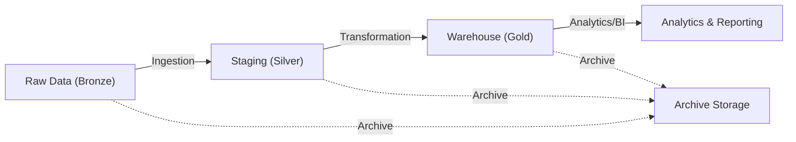

## Visual Architecture Diagram

# Automotive Finance Data Pipeline & Warehouse Builder

## Project Overview
This project simulates a production-grade data engineering platform within the Finance Department of an automotive manufacturing company. The goal is to design and build an automated pipeline that ingests raw financial and operational data from multiple enterprise systems, processes it through structured ingestion and transformation layers, and loads it into a centralized Finance Data Warehouse for analytics and reporting.
The solution reflects modern enterprise architecture, incorporating cloud storage (AWS S3), ETL/ELT pipelines, workflow orchestration (Airflow), monitoring, and performance optimization.

## Objectives
- Design a Finance Data Warehouse using a Star Schema model.
- Simulate multi-system automotive finance data sources (ERP, CRM, Finance, Suppliers, IoT).
- Implement cloud-based raw data storage (AWS S3).
- Build ingestion pipelines using Bash/Shell scripting.
- Develop Python ETL pipelines for multi-format data.
- Implement SQL ELT transformations for warehouse modeling.
- Orchestrate workflows using Apache Airflow.
- Enable monitoring, logging, and alerting.
- Simulate enterprise file lifecycle management.

## Business Domain Context
**Department:** Finance  
**Industry:** Automotive Manufacturing  
**Company:** Orion Motors (Simulated)

### Analytical Focus Areas
- Vehicle sales revenue
- Dealer performance
- Manufacturing costs
- Operating expenses
- Customer financing
- Supplier procurement costs
- Warranty and service liabilities
- Profitability analysis

### Executive Business Questions
- **Revenue:** Total revenue per year, revenue by dealer, revenue by vehicle model.
- **Costs:** Vehicle production costs, dealer commissions, operating expenses.
- **Profitability:** Profit per vehicle, profit per dealer, overall company profit.
- **Performance:** Best-performing dealers, best-selling models, revenue growth trends.

## Source Data Systems

## Cloud Storage Architecture
Raw data is stored in AWS S3 buckets representing enterprise data lake storage:

- **Raw (Bronze):** messy CSV, JSON, Excel files.
- **Staging (Silver):** cleaned parquet, normalized tables.
- **Warehouse (Gold):** star schema fact + dimension tables.
- **Archive:** historical backups.

## Data Warehouse Modeling
The warehouse follows a Star Schema design, supporting operational, financial, and predictive analytics for analysts, executives, and data scientists.

### Fact Tables
- **fact_sales**: Vehicle sales transactions (dealer, customer, vehicle, price, discount, channel, status)
- **fact_payments**: Payment transactions (sale, amount, method, status, reference)
- **fact_procurement**: Supplier procurement orders (supplier, vehicle, cost, status)
- **fact_inventory**: Inventory stock levels (vehicle, dealer, quantity, status)
- **fact_telemetry**: IoT sensor data (vehicle, timestamp, speed, fuel, engine, location)
- **fact_interactions**: CRM/customer interactions (customer, dealer, type, channel, outcome)

### Dimension Tables
- **dim_customer**: Customer attributes (SCD Type 2)
- **dim_dealer**: Dealer/location attributes
- **dim_vehicle**: Vehicle attributes (make, model, year)
- **dim_supplier**: Supplier attributes
- **dim_date**: Calendar and financial year hierarchies

**Features:**
- Surrogate keys for all dimensions
- Slowly Changing Dimensions (SCD Type 2) for customer and vehicle
- Historical tracking for all business entities
- Financial and operational aggregations

### Example Business Questions Supported

#### Analysts (Operational & Performance)
- Which dealers sold the most vehicles this quarter?
- What is the average discount per sale?
- How many active vs inactive customers purchased vehicles?
- Which provinces generate the most sales?
- Which vehicles are low stock or out of stock?

#### Executives (Strategic & Financial)
- What is total revenue by dealer, brand, or province?
- How much revenue is lost to discounts?
- Which vehicle types dominate sales?
- What percentage of payments failed or are pending?
- Which financing methods are most common?

#### Data Scientists (Predictive & IoT)
- Which customer attributes correlate with inactive status?
- Do IoT telemetry anomalies predict maintenance events?
- Which suppliers have frequent procurement delays or cancellations?

See the full schema in [`phase_1_data_warehouse_design/sql/warehouse_schema.sql`](finance-data-platform/phase_1_data_warehouse_design/sql/warehouse_schema.sql).

## Project Phases
- **Phase 0 — Environment Setup:** schemas, repo structure, S3 buckets.
- **Phase 1 — Data Generation:** Faker scripts, dirty data injection.
- **Phase 2 — S3 Ingestion:** Bash scripts, validation, archiving.
- **Phase 3 — Staging ETL:** Python extract/transform/load into staging schema.
- **Phase 4 — Warehouse ELT:** SQL transformations into star schema.
- **Phase 5 — Airflow Orchestration:** DAGs, sensors, operators, retries.
- **Phase 6 — Database Administration:** indexing, partitioning, backups.
- **Phase 7 — Monitoring & Logging:** dashboards, alerts, data quality metrics.
- **Phase 8 — Analytics:** BI dashboards, SQL queries, ML models.
- **Phase 9 — Documentation & Deployment:** runbooks, Dockerization, demo.

## Technology Stack

## Repository Structure

## Project Status
**Active development.**
Current focus:
- Warehouse schema deployment
- Staging ingestion pipelines
- S3 data lake setup
- Initial ELT transformations
Upcoming:
- Airflow orchestration
- Streaming ingestion
- Monitoring dashboards

## Author
Lerato Matamela  
Strategic Data Engineer — CAPACITI Programme

## License
This project is for educational and portfolio demonstration purposes.

---

✨ This updated README is clean, structured, and aligned with your repo + S3 buckets. It sets the stage for each phase and makes your project look enterprise-ready.

Would you like me to also add a visual architecture diagram (Bronze → Silver → Gold → Analytics) directly into your README so it’s more engaging for viewers?
