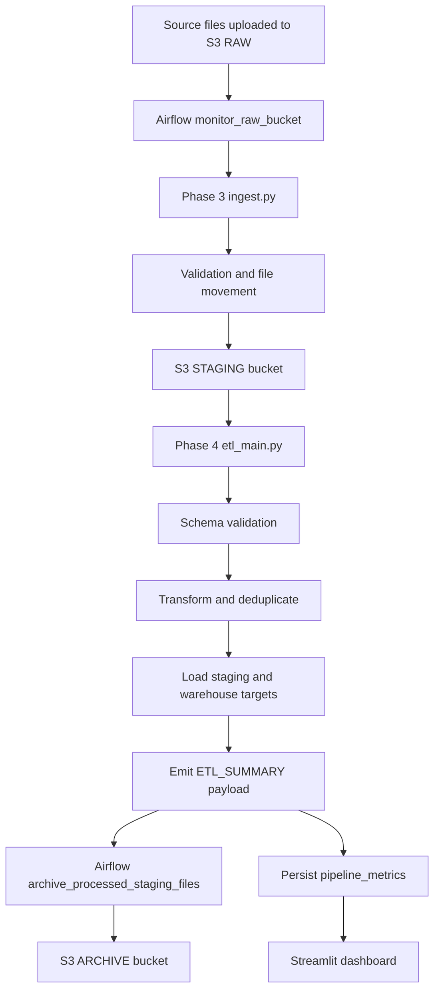
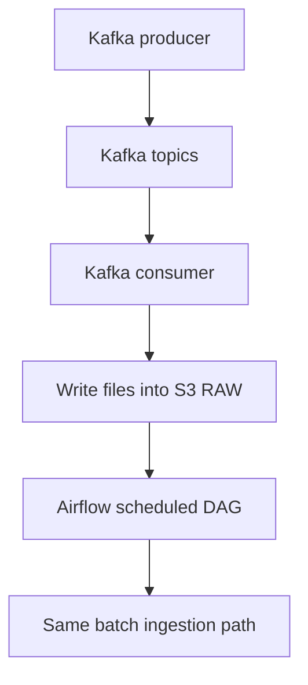
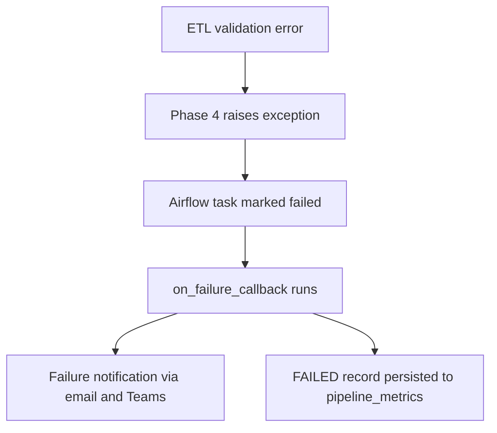

# ETL Pipeline Flowcharts

## Batch Pipeline Flow

## Streaming-Assisted Flow

## Error Flow

## Key Design Choice

The project uses one orchestration path. Batch uploads and Kafka-assisted ingestion both converge on the same Airflow DAG so alerting, archive handling, ETL logic, and monitoring stay consistent.